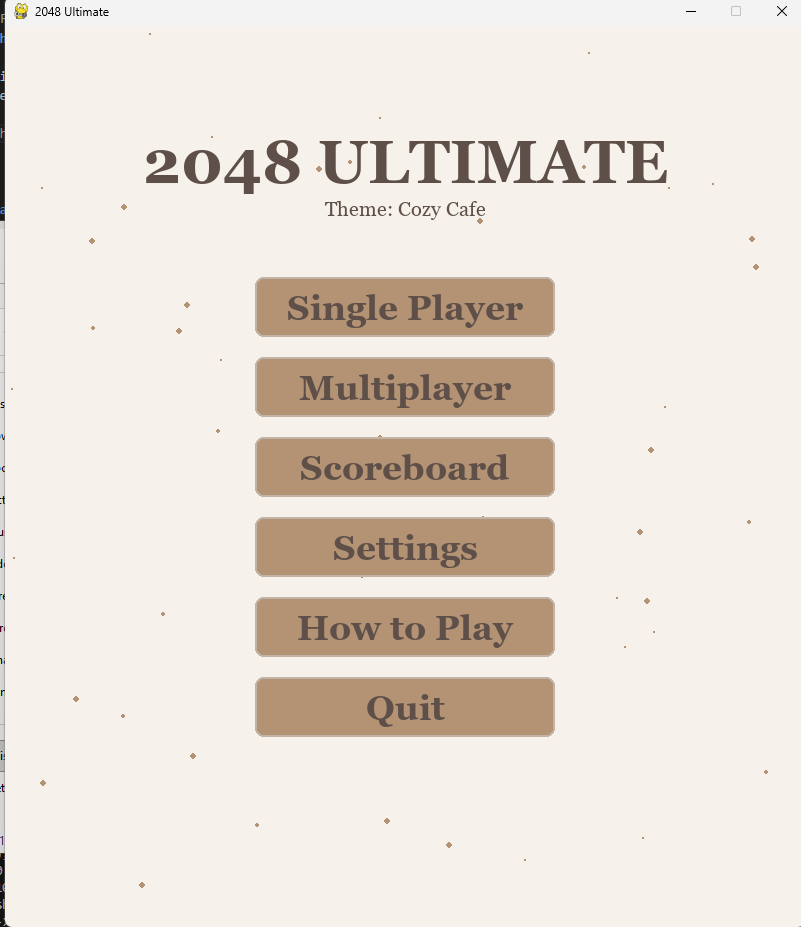
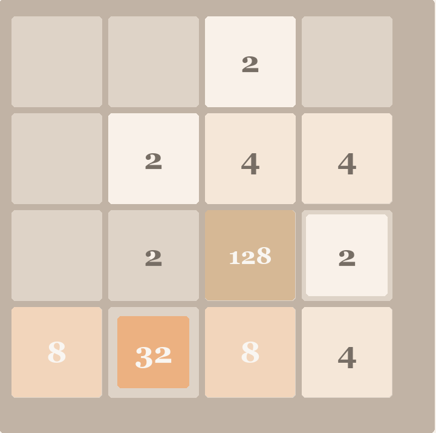

# 2048 Game in Python with Pygame

A complete recreation of the classic 2048 puzzle game, built from the ground up using Python and the Pygame library. This project provides a fully-featured, standalone 2048 experience with smooth animations and a clean, modern aesthetic.



## ✨ Features

* **Classic 2048 Gameplay**: The core objective is to slide and combine tiles to create the 2048 tile. The game continues after you reach 2048, allowing you to chase a new high score!
* **Fluid Tile Animations**: Tiles don't just snap into place; they glide smoothly across the board, providing a satisfying and polished visual experience.
* **Dynamic Color Palette**: The color of the tiles changes dynamically based on their value, making it easy to spot high-value tiles at a glance.
* **Clean & Modern UI**: Features a minimalistic design with a clear grid, rounded corners on the tiles, and a bold, easy-to-read font.
* **Game Over Detection**: The game intelligently detects when no more valid moves are possible and displays a clear "Game Over" screen.
* **Instant Restart**: From the game over screen, simply press the **'R'** key to instantly start a fresh game.
* **Standalone Executable**: The project can be easily packaged into a single `.exe` file that runs on Windows without needing Python or any libraries.

## 🎮 How to Play

* Use the **Arrow Keys** (←, ↑, →, ↓) to slide all tiles across the grid in one of the four directions.
* When two tiles with the same number collide, they merge into a new tile with double the value.
* A new tile (either a 2 or a 4) will appear in a random empty spot after every move.
* The game is won when you create a tile with the value **2048**.

## 🚀 Getting Started (for Developers)

### Prerequisites

* Python 3.x
* Pygame library

### Installation & Running from Source

1.  **Clone this repository:**
    ```bash
    git clone [https://github.com/Iam-shyamrathore/2048-game-using-pygame.git](https://github.com/Iam-shyamrathore/2048-game-using-pygame.git)
    ```

2.  **Navigate to the project directory:**
    ```bash
    cd 2048-game-using-pygame
    ```

3.  **Install dependencies:**
    ```bash
    pip install pygame
    ```

4.  **Run the game:**
    ```bash
    python 2048.py
    ```
    *(Note: You might need to use `python3` depending on your system configuration.)*

## 📦 Creating a Standalone Executable

You can package this game into a single executable file (`.exe`) to share with others.

1.  **Install PyInstaller:**
    ```bash
    pip install pyinstaller
    ```

2.  **Create the executable:**
    Run the following command from the project directory:
    ```bash
    pyinstaller --onefile --windowed --name "2048" 2048.py
    ```

3.  **Find your game:**
    The final `2048.exe` file will be located in the newly created `dist` folder.